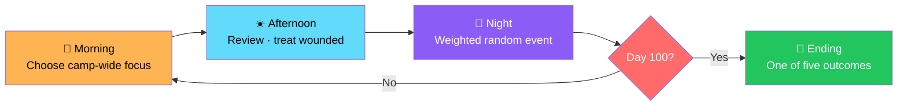
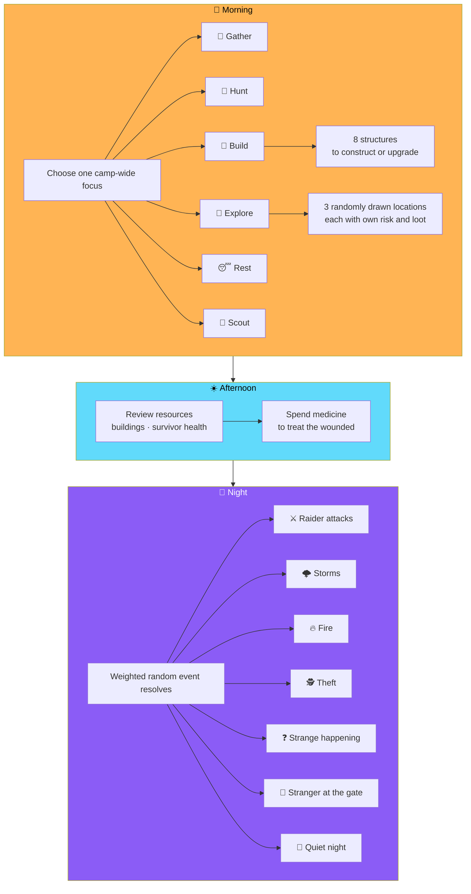
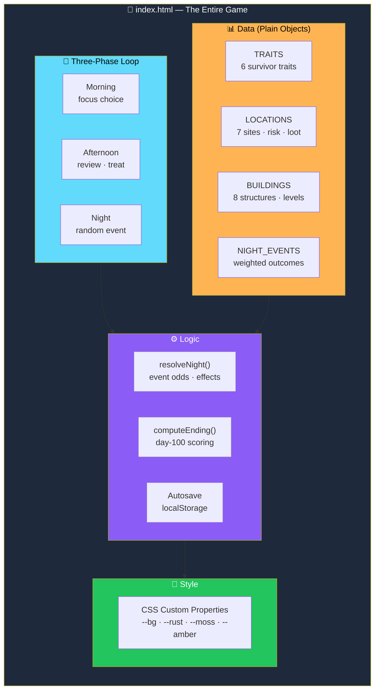
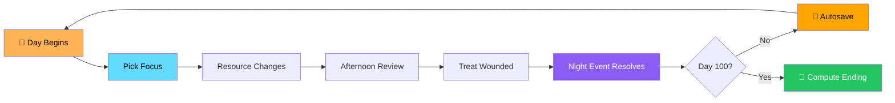

# 🏚️ 100 DAYS: APOCALYPSE

<div align="center">


**You have exactly 100 days to prepare your camp before the apocalypse arrives.**

*Every day is a trade-off. Every night, the camp is tested.*

[🎮 Play It](#-play-it) • [🎯 How It Plays](#-how-it-plays) • [🏁 Day 100](#-day-100) • [🎨 Customization](#-notes-for-customization)

</div>

---

## 📖 Overview

**100 DAYS: APOCALYPSE** is a browser-based survival strategy game.

You have exactly **100 days** to prepare your camp before an unknown apocalypse arrives — every day is a trade-off between gathering, building, exploring, and resting, and **every night the camp is tested**.

### Core Idea

> **Prepare, or perish.**
>
> Every decision compounds. Food runs out. Survivors get hurt. Raiders come. And on day 100, everything you've built determines whether you survive.

### The Rhythm



---

## 🎮 Play It

**Open `index.html` in any modern browser.**

> ✅ **No install, no server, no dependencies** — it's a single self-contained file.

### 💾 Autosave

Your run **autosaves to the browser's local storage after every action**, so you can close the tab and pick up where you left off.

**"Start a New Run"** from the title or ending screen **wipes the save and begins fresh**.

---

## 🎯 How It Plays

### Each Day Has Three Phases



### 🌅 Morning

Choose **one camp-wide focus**:

| Focus | Effect |
|-------|--------|
| **🌾 Gather** | Collect resources |
| **🏹 Hunt** | Bring in food |
| **🔨 Build** | Construct or upgrade structures |
| **🧭 Explore** | Venture out for loot |
| **😴 Rest** | Recover health and morale |
| **🔭 Scout** | Reduce surprise and improve night odds |

- **Building** opens a menu of **eight structures** to construct or upgrade
- **Exploring** offers **three randomly drawn locations**, each with its own **risk and loot table**

### ☀️ Afternoon

- **Review** resources, buildings, and survivor health
- **Spend medicine** to treat the wounded before night falls

### 🌙 Night

A **weighted random event** resolves:

- ⚔️ **Raider attacks**
- 🌩️ **Storms**
- 🔥 **Fire**
- 🕵️ **Theft**
- ❓ **A strange unexplained happening**
- 🚶 **A stranger arriving at the gate** — with a **real four-way choice**:
  - **Let them in**
  - **Trade**
  - **Question**
  - **Refuse**
  
  Each with different odds and outcomes
- 🌌 **A quiet night**

> 💡 **Your buildings, scouting, and soldiers all shift the odds in your favor.**

---

## 💧 Resources

**Six resources:**

| Resource | Use |
|----------|-----|
| **🍖 Food** | Consumed daily by every survivor |
| **💧 Water** | Consumed daily by every survivor |
| **🪵 Wood** | Building and repairing |
| **⚙️ Metal** | Advanced buildings and defenses |
| **💊 Medicine** | Treating the wounded |
| **⛽ Fuel** | Power and travel |

> ⚠️ **Food and water are consumed daily by every survivor. Let them run out and people start losing health.**

---

## 👥 Survivors

**Six traits**, each with a **real strength** and a **real weakness** that affects:

- Gathering
- Building cost
- Healing
- Combat
- Upkeep

| Trait | Role |
|-------|------|
| 🌾 **Farmer** | Food production |
| 🔧 **Engineer** | Building efficiency |
| ⚕️ **Doctor** | Healing |
| 🏹 **Hunter** | Food and combat |
| ⚔️ **Soldier** | Defense |
| 🔩 **Mechanic** | Equipment and repair |

---

## 🏗️ Buildings

**Eight structures** — each levels up and **meaningfully changes your odds**:

| Building | Effect |
|----------|--------|
| 🏠 **Shelter** | Survivor capacity and morale |
| 🌾 **Farm** | Yields passive food |
| 📦 **Storage** | Increases resource caps |
| 🔧 **Workshop** | Cuts build costs |
| 🔭 **Watchtower** | Cuts attack frequency |
| ⚕️ **Medical Room** | Improves healing |
| ⚡ **Generator** | Powers other buildings |
| 🧱 **Defensive Wall** | Cuts attack damage |

---

## 🧭 Locations to Explore

**Seven sites** with different risk and reward profiles:

| Location | Risk | Loot |
|----------|:----:|------|
| 🛒 **Abandoned Supermarket** | Low | Food and water |
| 🏥 **Hospital** | Medium | Medicine |
| 🚓 **Police Station** | Medium | Weapons and ammo |
| ⛽ **Gas Station** | Low | Fuel |
| 🌲 **Forest** | Low | Wood |
| 🪖 **Military Base** | **High** | **Big payoff or a lost survivor** |
| 🕳️ **Underground Bunker** | **High** | **Big payoff or a lost survivor** |

> 💡 **Low-risk sites give modest, reliable loot. High-risk sites can pay off big or cost you a survivor.**

---

## 🏁 Day 100

> **What you've built determines which of five endings you get.**

| Ending | What It Means |
|--------|--------------|
| 💀 **Overrun** | The camp didn't hold |
| 🏚️ **Left Alone** | Survived, but barely — the world moved on without you |
| 🛡️ **Held the Line** | You made it through — a hard-won survival |
| 🏰 **A True Fortress** | Defense in depth, resources in reserve |
| 🌱 **A Thriving Community** | Not just surviving — flourishing |

Scored on:

- **Survivors**
- **Defense**
- **Resources**
- **Base health**

---

## 📁 Files

```
100-days-apocalypse/
├── index.html   # the entire game — open this
└── README.md    # this file
```

> 💡 **No build step, no external JS dependencies — just HTML, CSS, and vanilla JavaScript in one file.**

---

## 🏗️ Architecture

### Everything in One File



### The Core Loop



### Design Principles

<div align="center">

| Principle | Implementation |
|-----------|---------------|
| **📄 One file, zero dependencies** | The whole game is one HTML file — no build step, works offline |
| **📊 Content is data** | `TRAITS`, `LOCATIONS`, `BUILDINGS`, and `NIGHT_EVENTS` are plain objects — safe to tweak, extend, or rename |
| **🎲 Weighted odds, real choices** | Night events use weighted probabilities; the stranger at the gate has four real options with different outcomes |
| **👥 Survivors matter individually** | Six traits with real strengths and weaknesses that change gathering, building, healing, combat, and upkeep |
| **🏗️ Every building changes the math** | Buildings and upgrades shift the odds — they're not cosmetic |
| **💾 Autosave after every action** | Close the tab, come back, resume — no lost progress |
| **🎨 CSS-variable theming** | Change the palette at `:root` and the whole game reskins |
| **🏁 Five endings, honestly earned** | Day-100 scoring based on survivors, defense, resources, and base health — not a coin flip |
| **🚫 No fake features** | Nothing pretends to exist that doesn't |

</div>

---

## 🎨 Notes for Customization

**The whole game lives in `index.html`.**

### 📊 Data Objects

**`TRAITS`, `LOCATIONS`, and `BUILDINGS`** near the top of the `<script>` block are plain data objects — **safe to tweak numbers, add entries, or rename things without touching any logic.**

### 🌙 Night Events

**`NIGHT_EVENTS`** / **`resolveNight()`** controls the night event odds and effects.

### 🏁 Endings

**`computeEnding()`** controls the day-100 scoring and ending text.

### 🎨 Theming

Styling is a single `<style>` block using **CSS custom properties** at the top:

```css
:root {
  --bg: ...;
  --rust: ...;
  --moss: ...;
  --amber: ...;
  /* ... */
}
```

> 💡 **Change the palette there to reskin the whole game.**

---

## 🗺️ Roadmap

### ✅ Current

- [x] Single-file, self-contained game
- [x] 100-day survival loop with three phases per day
- [x] Six camp-wide focuses — Gather, Hunt, Build, Explore, Rest, Scout
- [x] Eight buildings with meaningful upgrades
- [x] Six survivor traits with real strengths and weaknesses
- [x] Six resources with daily consumption for food and water
- [x] Seven exploration locations with risk and loot tables
- [x] Weighted night events — raiders, storms, fire, theft, strange happenings, stranger, quiet
- [x] Four-way stranger decision with different odds and outcomes
- [x] Medicine spending to treat the wounded
- [x] Five endings based on day-100 scoring
- [x] Autosave after every action
- [x] "Start a New Run" clears the save
- [x] CSS-variable theming
- [x] Data-driven traits, locations, buildings, and events

### 🔜 Future Ideas

- [ ] Additional survivor traits and interactions
- [ ] More building types and synergies
- [ ] Multiple camps or settlements
- [ ] Long-term narrative arcs across runs
- [ ] Daily challenge runs with fixed seeds
- [ ] Achievements
- [ ] Statistics tracking across runs
- [ ] Difficulty modes
- [ ] Sound and music (synthesized)
- [ ] Mobile-optimized touch UI

---

## 🤝 Contributing

Contributions are welcome. Please:

1. Fork the repository
2. **Keep it single-file** — no external build step, no bundler
3. **Keep content in data objects** — `TRAITS`, `LOCATIONS`, `BUILDINGS`, `NIGHT_EVENTS`
4. **Preserve the three-phase day structure** — Morning, Afternoon, Night
5. **Keep the autosave honest** — every action saves
6. **Keep the endings earned** — no randomness in the final scoring
7. Test on both desktop and mobile
8. Submit a Pull Request

### Guidelines

- **Never add a required external dependency**
- **Never require a build step** — `index.html` and nothing else
- **Never let resource consumption be trivial** — the tension is the game
- **Never add a fake choice** — every option must have real outcomes
- **Never break the save format** without a migration path
- **Never present a stub as a feature**

---

## 📜 License

MIT — see [LICENSE](LICENSE) for details.

---

## 🙏 Acknowledgments

- **Every survival game that made you care about individual people** — this one's for you
- **Every camp that ever ran out of food on day 47** — this one's for you

---

<div align="center">

### 🏚️ 100 DAYS. THREE PHASES A DAY. ONE OUTCOME.

**You have exactly 100 days to prepare.**

**Every day is a trade-off. Every night, the camp is tested.**

<br>

### ⚠️ Prepare, or perish.

<br>

⭐ If you survived to day 100, consider giving it a star.

<br>

[⬆ Back to Top](#️-100-days-apocalypse)

</div>
